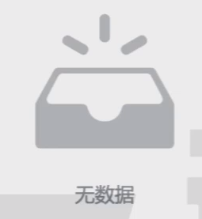

# Avatar

## 属性
| 属性名  |    含义     |   类型   | 必填 | 默认值 |
|:----:|:---------:|:------:|:--:|:---:|
| url  |  头像图片路径   | String | 是  |  无  |
| size | 头像尺寸，宽高相等 | Number | 否  | 150 |
---

# Icon
图标组件
使用的图标来源来自于 [阿里巴巴矢量库]
## 属性
| 属性名  |    含义     |   类型   | 必填 | 默认值 |
|:----:|:---------:|:------:|:--:|:---:|
|   |     |  |   |    |
|  |  |  |   |  |
---

# Empty
  
该组件需要在外层容器中横向垂直居中
## 属性
| 属性名  |  含义   |   类型   | 必填 | 默认值 |
|:----:|:-----:|:------:|:--:|:---:|
| text | 显示的文字 | String | 否  | 无数据 |
---

# ImageLoader
该组件可以实现一个渐进式图片

## 属性
|     属性名     |             含义             |   类型   | 必填 | 默认值 | 
|:-----------:|:--------------------------:|:------:|:--:|:---:|
|     src     |          原始图片的路径           | String | 是  |  无  |
| placeholder |       原始图片加载完成前的占位图片       | String | 是  |  无  |
|  duration   | 原始图片加载完成后，由占位图片切换到原始图片的毫秒数 | Number | 否  | 500 |

## 事件
| 事件名  |     含义      | 事件参数 | 参数类型 | 
|:----:|:-----------:|:----:|:----:|
| load | 原始图片加载完成后触发 |  无   |  无   |
---

# Contact
  
该组件需要横向撑满容器，背景色透明
> 1. 如何实现点击弹出QQ对话？
> 设置超链接为：tencent://message/?Menu=yes&uni=要对话的QQ号&Service=300&sigT=...
> 2. 如何实现点击弹出发送右键？
> 设置超连接为：mailto:邮件地址

# Menu

