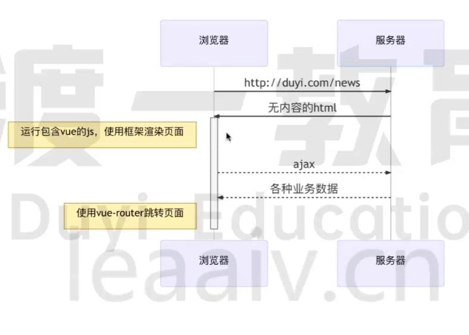

一、服务端渲染：
1. 浏览器请求页面：如，输入一个网址（https://www.baidu.com）；
2. 服务器组装页面（服务器端渲染）：服务器中，将html页面组装好，输入一个完整的html页面；
3. 服务器将完整页面传输给浏览器渲染：将2中的html页面渲染出来；

二、前后端分离：
1. 浏览器请求页面：如，输入一个网址（https://www.baidu.com）；
2. 服务器返回无内容的html和js文件：这个html和js文件由前端编写，html中只是一个空架子，没有业务内容；
3. 浏览器运行js文件，通过ajax拿业务数据，创建元素，渲染页面，组装填充html；
4. 浏览器得到渲染；

三、单页面：
背景：
由于以前的模式是一个页面一个页面展示；
每次切换页面的时候，需要重新请求一个后台；容易导致卡顿；
期望像软件一样，提高响应速度；所以有了单页面应用；

单页面-流程：
1. 浏览器请求页面：如，输入一个网址（https://www.baidu.com）；
2. 服务器返回一个空的html，和一堆js文件；此时页面为空，没有内容；
3. 浏览器运行js文件，创建元素、渲染页面；
4. 浏览器缺少数据，通过ajax请求，获取后台数据；
5. 跳转页面；
6. 再重新执行js文件，通过ajax请求，获取后台数据，js重构页面；
7. 注意：页面没有刷新，还是原来的页面；
8. 浏览器渲染js重构出来的页面；

四、vue框架

1. 浏览器请求页面：如，输入一个网址（https://www.baidu.com）；
2. 服务器返回无内容的html和js文件；
3. 浏览器运行包含vue的js，使用框架渲染页面；
4. 通过ajax请求，获取后台数据；
5. 使用vue-router跳转页面；