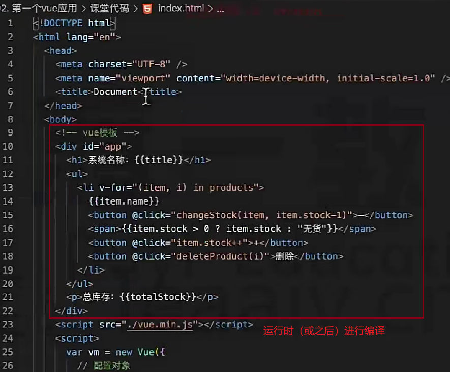
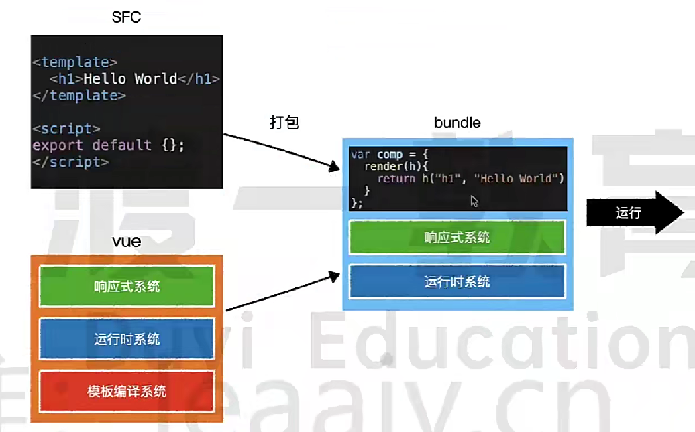

### 虚拟DOM树
直接操作真实的dom会导致严重的效率问题，vue使用虚拟dom（vnode）的方式来描述要渲染的内容；
vnode是一个普通的js对象，用于描述界面上应该有什么。
操作真实dom会触发浏览器的重排和重流等-》每改一次就会触发一次；

``` js
// 如：
  const node = {
    tag: 'h1',
    children: [
      {tag: undefined, text: '第一个应用'}
    ]   
  }
  // 上述内容为：有一个h1标题节点，该节点有一个子节点，该子节点是一个文本节点，文本内容为“第一个应用”
```

 - vue模板并不是真实的dom，它会被编译为虚拟dom
``` vue
  <div id='app'>
    <h1>第一个vue应用：{{title}}</h1>
    <p>作者：{{author}}</p>
  </div>
```
- 上述模板，会被编译为下面的虚拟dom
``` js
{
  tag: 'div',
  children: [
    {tag: 'h1', children: [{text: '第一个应用: hello world'}]},
    {tag: 'p', children: [{text: '作者：aa'}]}
  ]
}
``` 


- 引出一个重要函数：render；答：将模板编译为虚拟dom
### render逻辑
- 问题：render的作用是什么？
1. render函数，是将模板编译为虚拟dom的关键函数；
2. 编译过程：<br>
  2.1 首先，是否存在render函数，存在，则直接执行；
  2.2 然后，看是否存在template属性，存在，则将template编译为虚拟dom
  2.3 最后，看是否存在"el"绑定的html节点，存在，则将该节点下的子节点编译为虚拟dom。
  2.4 再最后，返回虚拟dom。
- 注意：虚拟节点树必须是单根。


### 挂载
- 什么是挂载？答：就是将真实的dom树，放到页面上的某个元素的位置；

**
#### 挂载的两种方式
1. 使用el: '#app'；
2. 使用vm.$mount('#app');

### 完整流程


#### 举例说明

1. 点击+按钮，改变stock数据；
2. 触发render函数，重新渲染；<br>
  2.1 重新生成虚拟dom树；<br>
  2.2 对比新旧树的差异；<br>
  2.3 将差异应用到真实dom中；

## 预编译
1. 什么是编译？
答：简而言之，将vue中的单文件组件（SFC）或模板转化为浏览器可以直接执行的JavaScript代码的过程。
有三个步骤：1. 模板解析；2. 转化为渲染函数；3. 优化和生成代码；
2. 背景：html中，直接写的模板，是运行时（或之后）再进行编译的。webpack中，是先打包再运行；

3. 概念：当*vue-cli*进行打包的时候，会直接将组件中的模板转换为render函数，这就叫做模板预编译；
4. 作用：
- 运行时就不需要再编译模板了，提高了运行效率；
- 打包结果中不再需要vue的编译代码，减少了打包体积；


 