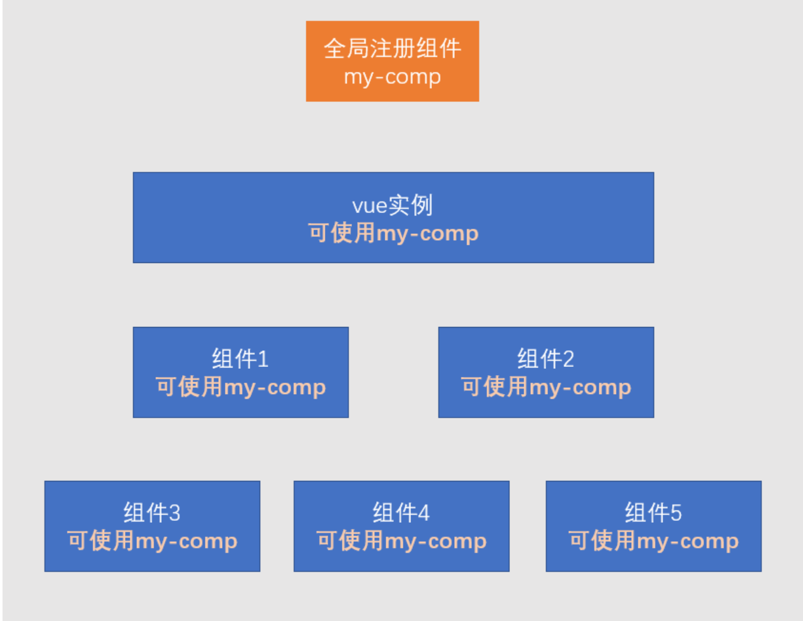
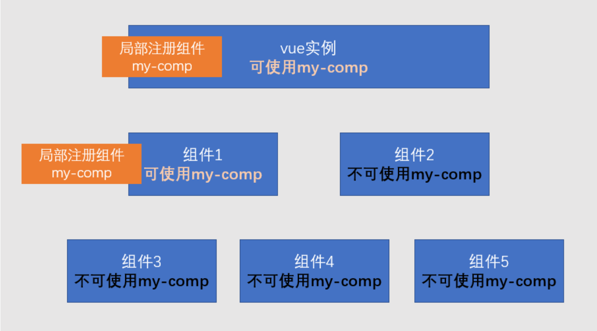
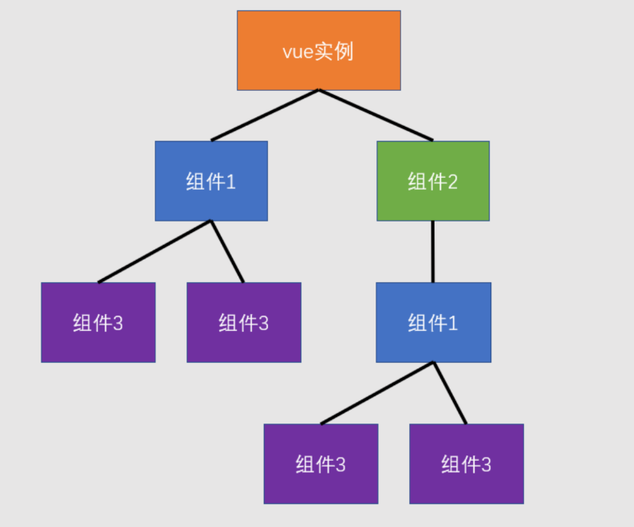
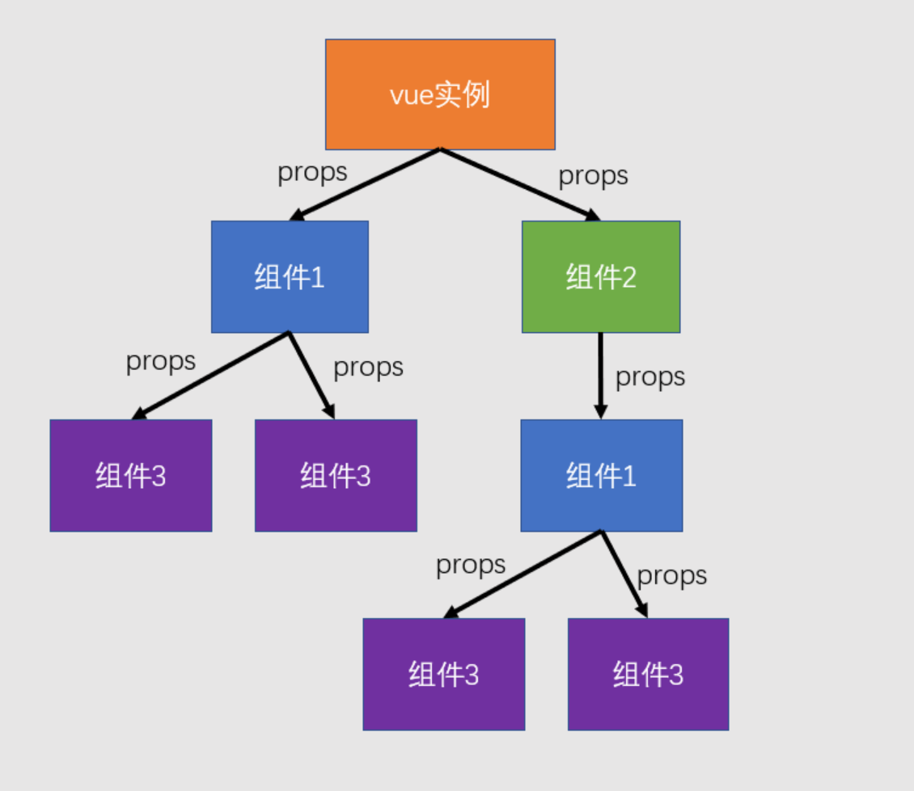

# 组件

## 一、前言
### 1）背景
没有组件，会有什么问题？
> 一个页面，只有一个根文件，里面包含了header、侧边栏、核心内容等等所有区域代码。
> 1. 由于所有区域的代码都写在一个文件里，那每次修改都要在这个文件里修改，逻辑会非常的长，整体看上去非常复杂，代码的可读性很差、也不好维护；
> 2. 有一些代码，可能有多处地方想要用到，且部分内容支持定制。

### 2）组件的优点（架构思维）
每个功能区域的代码抽离为单独的组件，会有以下好处：
> 1. 降低了代码的复杂度，提高可读性、更利于后期维护。
> 2. 提高了代码的复用性。

### 3）组件的构成
一个组件就是一个特定的区域（如侧边栏组件、文章列组件）
> 1. 内容（模板代码template）
> 2. 功能（js代码）
> 3. 样式（css代码）

## 二、组件开发
### 1）创建组件
#### 组件的本质是什么？
> 组件的本质，其实就是一个“**配置对象**”，和new Vue(options)中的配置对象options几乎一致。
> ```js
> // 组件配置对象：
> const MyComp = {
>   template: `<button @click="count++">点击数字加1{{count}}</button>`,
>   data() {
>     return {
>       count: 0,
>     }
>   },
>   methods: {}
> }
> ```
#### 组件和vue实例有什么不同？
> 1. vue实例通过“el”来指定需要编译的模板。
> 组件则只能通过“template”或者“render”来指定模板，从而编译出虚拟dom树；（想想为什么？）
> 2. 组件的data必须是一个函数。
#### 补充问题：为什么vue实例有el，而组件没有el？
> 答：因为一个vue实例，只能有一个根组件，而对应的真实dom树根节点，只能有一个（如\<div id="app"></div\>）。<br>
> 根组件可以通过“el: '#app'”或者“.$mount('#app')”挂载到真实dom树上。
> 其他的组件无需挂载。

### 2）注册组件
> 注册组件有两种方式：全局注册、局部注册


#### 全局注册
通过Vue.component('my-component', MyButton)，或者Vue.component('MyButton', MyButton)；
> 1. 参数1：组件名；
> 2. 参数2：组件配置对象（或者说组件本身）

注意：非必要不要用全局注册
> 由于打包的时候，会编译main.js文件，而全局组件是在main.js文件中单独注册的，会增加打包的压力。

#### 局部注册
和data() {}同级，components: {'my-component': MyButton}，或者components: {MyButton: MyButton}

### 3) 应用组件
```js
const vm = new Vue({
  data() {},
  components: {
    'my-component': MyButton,
    MyAvatar,
  },
  template: `
    <my-component />
    <my-avatar />
    <MyAvatar />
  `
})
```
> 注意：命名方式有三种：
> 1. 小驼峰命名：myButton -》不推荐；
> 2. 横杠命名：my-button -》不推荐；不能通过MyButton来应用；
> 3. 大驼峰命名：MyButton -》推荐：应用的时候，既可以写成<my-button>，也可以写成<MyButton>

## 三、组件树

### 向子组件传递数据：

> 组件属性，即props，为只读的单向数据，仅允许父组件向子组件传递数据，且子组件无法修改；
