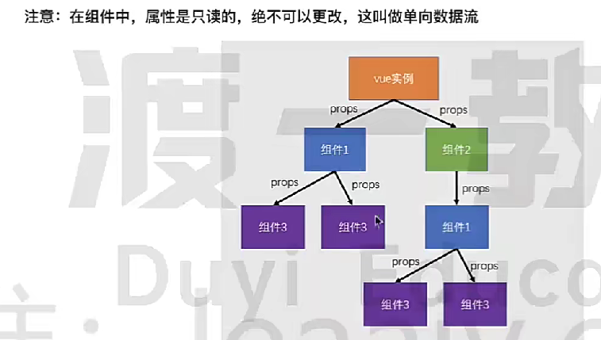

### 组件出现的原因：
1. 降低整体复杂度，提升代码的可读性和可维护性；
2. 提升局部代码的复用性；
- 从颗粒度角度看：颗粒度越小，越好；
  - 整个页面-》颗粒度大；
  - 某个输入框-》颗粒度小；

### 组件的内容：
1. 内容（模板代码）；
2. 功能（js代码）； 
3. 样式（css代码）；

- 注意：子组件中，不可修改props传入的属性（因为这个属性值是父组件定义的）；