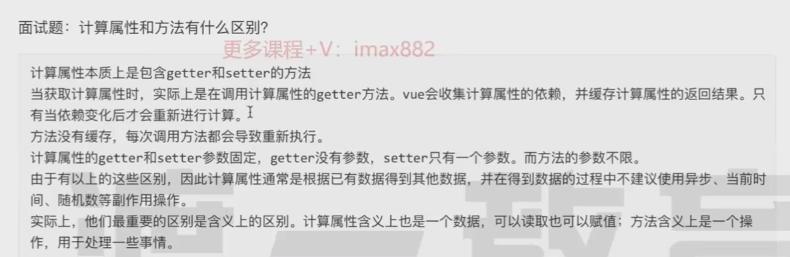
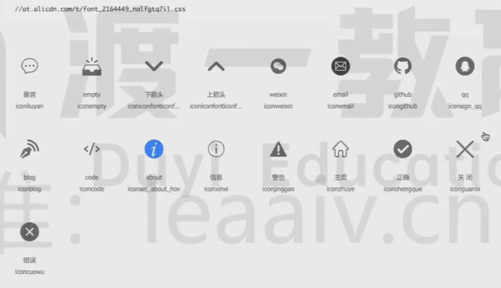
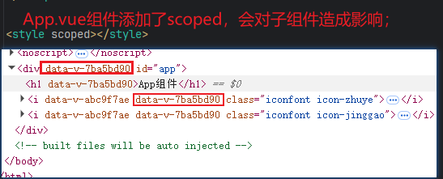
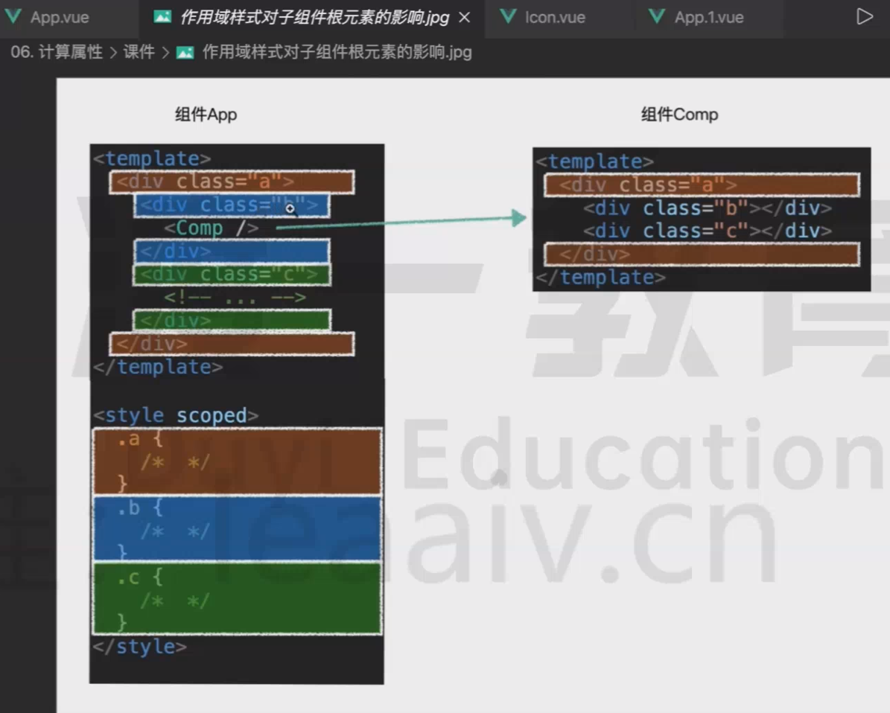
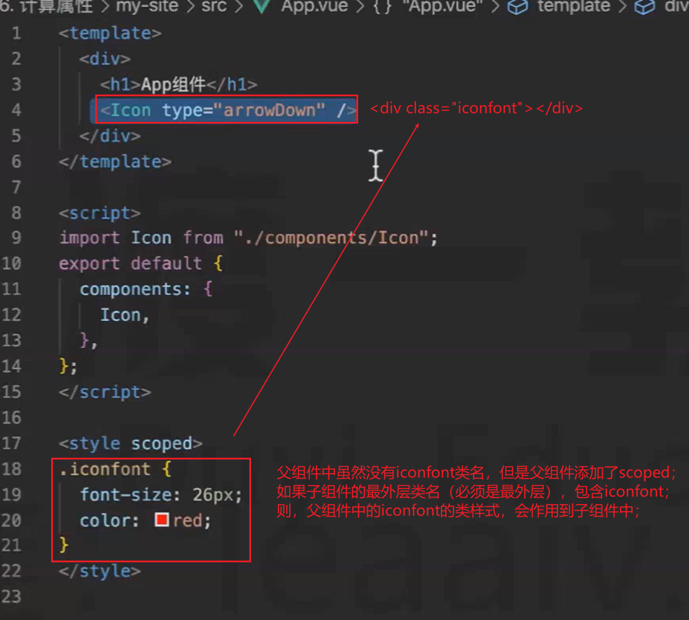

## 一、计算属性
完整的计算属性：
```vue
computed: {
    get() {},
    set(val) {}
}
```
<hr>

题目：当点击button的时候，是否会执行fullName中的get方法？<br>
> 答：不会，因为执行fullName=‘Bb’的时候，set内部没有修改firstName或者lastName；<br>
> 必须要修改fullName的依赖项（必须是响应式数据，Date.now()就不行），firstName和lastName；
```vue
<template>
  <p>{{fullName}}</p>
  <p>{{fullName}}</p>
  <button @click="fullName='Bb'">修改姓名</button>
</template>
<script>
  export default {
    data() {
      return {
        firstName: 'A',
        lastName: 'a'
      }
    },
    computed: {
      fullName: {
        get() {
          console.log('fullName called');
          return this.firstName + this.lastName;
        },
        set(val) {
          console.log('正在设置全名', val)
        }
      }
    },
    methods: {
      meFullName() {
          console.log('fullName called');
          // 如果这里比较复杂，每有一个地方使用meFullName的时候，都会重新执行一次，而computed则不会；
          const arr = new Array(1000000);
          arr.forEach((item, index) => {
            const it = index + 1;
          })
          return this.firstName + this.lastName;
      }
    }
  }
</script>
```

注意：
> 1. computed的依赖项如果不发生变化，如firstName和lastName不变，则computed的结果不变（调用再多次也不会触发get方法）；
> 2. computed的依赖项，只针对响应式数据，如果是return this.a + Date.now()，当Date.now()变化时，不会引起computed结果的变化；
> 3. computed内，不要使用异步。
<hr>


<hr>

## 图标组件


### 为什么要封装图标组件？
> ```js
> // 这样就可以直接使用图标了，比一个一个写图标要简单很多。
>  <Icon type="home" />
> ```

### 父组件会对子组件的根标签，造成影响；


