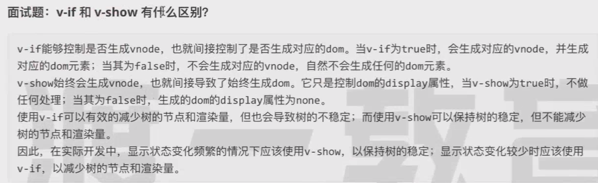
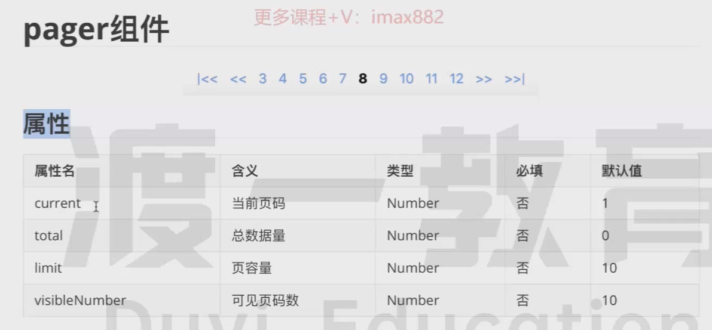
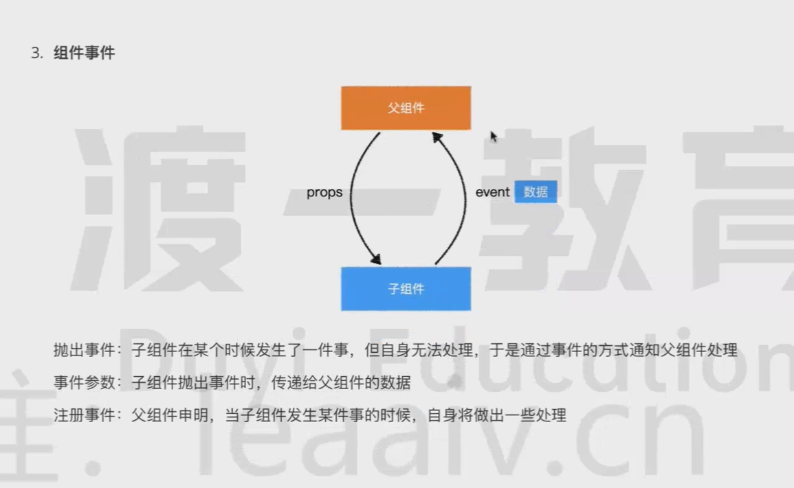

### 全局样式
#### 1. less可以声明变量
- 新建一个var.less文件；
- @primary: 囗 #6b9eee; // 主色调、链接

#### 2. global.less文件
- 新建一个全局文件；
- 引入var.less文件：import './var.less'
- 定义html、body、a等公共标签样式；

#### 3. vue中引入var.less文件；
```vue
<style lang="less" scoped>
  //@import "~@/styles/var.less";
  //a {
    //color: @primary;
  //}
</style>
```
<hr>

### 问题：v-if和v-show的区别

<hr>

### Pager.vue中属性解释

<hr>

### 组件事件

